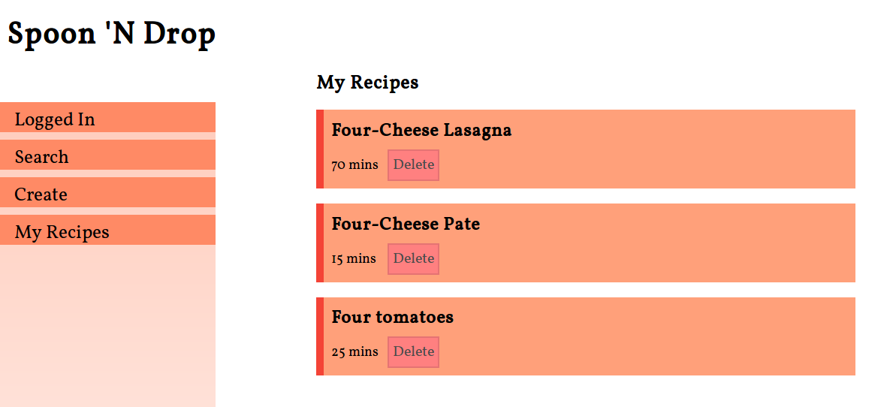

# Spoon 'N Drop
A client-side recipe app to look up recipes and save them to your Dropbox.

## Motivation
Intended to be a SPA that users can view recipes from [Spoonacular's](https://spoonacular.com) database without having to be sent to other websites. Recipes can then be stored in private storage, like [Dropbox](https://dropbox.com), and be retrieved later without having to go through extra steps.

## Technical Features
- Mobile Responsive UI
- OAuth login
- SPA
- AJAX

## Tech Composition
Spoon 'N Drop is written in HTML, CSS, and Javascript. The Javascript library, JQuery, is used for DOM manipulation, AJAX, and other convenience functions for data manipulation. [Rollup](https://github.com/rollup/rollup), a Javascript bundler, was used to create modular scripts and enforce an MVC architecture.

## APIs
Two APIs were used, the [Dropbox API v2](https://www.dropbox.com/developers) and the [Spoonacular API](https://spoonacular.com/food-api) through [Mashape Marketplace](https://market.mashape.com/explore).

### Dropbox
HTTP endpoints used involve OAuth logins and file download and uploads. The OAuth endpoint is actually a redirect url which prompts the user with a login before redirecting the user back to the app.

### Spoonacular
Search queries and get recipe details that span across hundreds of food websites. Information such as recipe image, title, ingredients, and directions(if exist), are retrieved and stored.

## Future Plans
Implement a server-side component to handle queries, data management, key storage, and provide better security.
